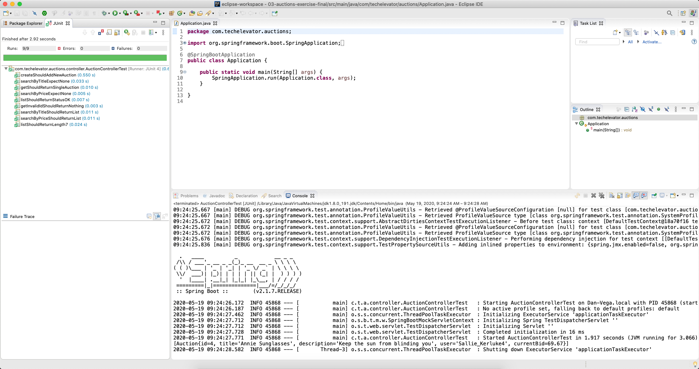

# Server-Side APIs: Part 1 Exercise (Java)

Previously, you created a command-line application that made requests to an API server. In this exercise, you'll re-create the API server in Java to handle `GET` and `POST` requests.

## Step One: Import into Eclipse and explore starting code

Import the auctions starter code into Eclipse using the `Import Existing Maven Projects` feature. After you have imported the project, review the starting code.

### Models

In the `model` package, there's an `Auction.java` model that has the same properties as the `Auction` class you've been working with.

### DAO

In the `DAO` package, there's a `MemoryAuctionDao.java` class that provides data access code. To reduce complexity, a static `List` is used instead of a real database. Also, there are some methods in there that you'll call from the controller.

### Controllers

In the `controller` package, there's an `AuctionController.java` class that you'll work in today.
You'll create the methods for the API. The controller class already contains the necessary `@RestController` and `@RequestMapping` annotations. The value for `@RequestMapping` is `/actions` which is the base path for all the request mappings defined in this controller.

### Tests

In `src/test/java/com/techelevator/auctions/controller`, you'll find the test class `AuctionControllerTest` which has all of the tests for the methods you'll write today. After you complete each step, more tests pass.

If you also want to run the server and test with Postman or the browser, feel free to do so. However, you should primarily focus on having the tests pass.

## Step Two: Implement the `list()` method

This method's purpose is to return a list of all auctions.

In `AuctionController.java`, create a method named `list()` that returns a `List<Auction>`. Then add the `@RequestMapping` annotation to have this method respond to `GET` requests for `/auctions`.

All this method needs to do is return `dao.list()`.

If completed properly, the `listShouldReturnStatusOK()` and `listShouldReturnCorrectCount` tests pass.

## Step Three: Implement the `get()` action

This method's purpose is to return a specific auction based on the value passed to it.

In `AuctionController.java`, create a method named `get()` that accepts an `int` and returns an `Auction`.

Add the `@RequestMapping` annotation to this method to respond to `GET` requests for `/auctions` with a number following it—for example, `/auctions/7`. You'll need to pass a value to the path to tell it to accept a dynamic parameter.

Have this method return an `Auction` from `dao.get()`, passing it the `int` that was passed to the action method.

If completed properly, the `getShouldReturnSingleAuction` and `getInvalidIdShouldReturnNothing` tests pass.

## Step Four: Implement the `create()` action

This method's purpose is to add the auction that's passed to it.

In `AuctionController.java`, create a method named `create()` that accepts an `Auction` and returns an `Auction`.

Add the `@RequestMapping` annotation to have this method respond to `POST` requests for `/auctions`.

Next, have this method call `dao.create()`, passing it the `Auction` that was passed to the action method. Set the return value from `dao.create()` to a new `Auction` object.

If completed properly, the `createShouldAddNewAuction` test passes.

## Step Five: Add searching by title

This method's purpose is to enable searching by title. You'll pass in an optional query string parameter that returns all auctions with the search term in the title.

In `AuctionController.java`, return to the `list()` action method. Add a `String` request parameter with the name `title_like`. You'll need to make this parameter optional, which means you set a default value for it in the parameter declaration. In this case, you want to set the default value to an empty string `""`.

In the `list()` method, before `dao.list()` is called, add an `if` statement to check if `title_like` isn't an empty string. If it's not empty, return `dao.searchByTitle()`, passing it `title_like`; else return `dao.list()` like before.

If completed properly, the `searchByTitleShouldReturnList` and `searchByTitleExpectNone` tests pass.

## Step Six: Add searching by price

This method's purpose is to enable searching by price. You'll pass in an optional query string parameter that returns all auctions with the current bid less than or equal to the value passed to it.

In `AuctionController.java`, return to the `list()` action method. Add another optional parameter after `title_like`—this time a `double` with the name `currentBid_lte`. Set the default value to `0`. Based on how `title_like` was declared, you should be able to figure out how to declare `currentBid_lte`.

In the `list()` method, add another `if` statement to check if `currentBid_lte` is greater than zero. If it's greater than zero, return `dao.searchByPrice()`, passing it `currentBid_lte`.

If completed properly, the `searchByPriceShouldReturnList` and `searchByPriceExpectNone` tests pass.

---

If you completed all of the steps correctly, all of your tests pass.

